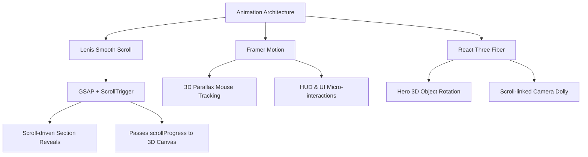

# A. Zahi Faleel – Cyber Terminal Portfolio: Architecture Documentation

This document provides a comprehensive overview of the portfolio website of **A. Zahi Faleel**. It details the site's architecture, technology stack, directory structure, UI/UX choices, 3D rendering workflows, and performance/SEO configurations.

---

## 🚀 1. Technology Stack Overview

The website is designed as a modern, high-fidelity single-page portfolio application following a "Cyber Terminal" aesthetic. The core 5-system stack includes:

*   **Framework**: [React 18](https://react.dev/) – Component-driven frontend library.
*   **Language**: [TypeScript](https://www.typescriptlang.org/) – Adding static typing and interface definitions for robust development.
*   **Build Tool**: [Vite](https://vitejs.dev/) – High-performance development server and bundler.
*   **Styling**: [Tailwind CSS v3](https://tailwindcss.com/) & Vanilla CSS – Utility-first styling framework with custom token overrides and dynamic CSS variables for theme management.
*   **1. Kinetic Smooth Scrolling**: [Lenis](https://lenis.darkroom.engineering/) is the master scroll driver, providing buttery smooth scroll interpolation.
*   **2. Immersive Storytelling**: [GSAP (GreenSock)](https://greensock.com/gsap/) with the **ScrollTrigger** plugin for complex scroll-driven, scroll-linked timeline transitions.
*   **3. Interactive 3D Hero Scene**: [Three.js](https://threejs.org/) via [@react-three/fiber](https://r3f.docs.pmnd.rs/getting-started/introduction) and [@react-three/drei](https://github.com/pmndrs/drei) to render a dynamic, scroll-responsive holographic artifact.
*   **4. HUD / Glass Interface**: [Framer Motion](https://www.framer.com/motion/) for element-level micro-interactions, layout transitions, exit animations, and magnetic cursors.
*   **5. Ambient Cyber Audio FX**: Web Audio API via `use-sound` for low-latency, synthesized UI feedback (hums, clicks, blips) with zero static asset footprint.

---

## 📂 2. Directory Structure & Roles

```text
Portfolio_Zahi/
├── docs/                      # Project documentation and summary files
│   ├── PROJECT_SUMMARY.md     # Detailed architecture and design breakdown
│   └── CMS_SETUP.md           # Documentation for the Supabase CMS layer
├── public/                    # Static assets
├── src/                       # Application source code
│   ├── components/            # UI components and page sections
│   │   ├── three/             # R3F canvas, meshes, and 3D scenes
│   │   ├── hud/               # Cyber terminal UI overlays (beams, corners)
│   │   └── ...                # Core page sections (About, Hero, Journey, etc.)
│   ├── hooks/                 # Custom React hooks (CMS hooks, useDarkMode, etc.)
│   ├── types/                 # TypeScript interfaces
│   ├── utils/                 # Utility files and GSAP configurations
│   ├── App.tsx                # Main layout, Lenis setup, and section orchestration
│   ├── index.css              # Global styles, token overrides, and CSS animations
│   └── main.tsx               # Client entry point
└── tailwind.config.js         # Tailwind configuration mapped to CSS variables
```

### Key Source Files & Functions

*   `src/App.tsx`: Orchestrates the main layout, initializes Lenis smooth scrolling, mounts the background R3F Canvas, and plays the ambient background audio.
*   `src/index.css`: Maps Tailwind accent colors (`--ct-cyan`, `--ct-purple`) to ensure flawless transitioning between the default Cyber Dark Mode and Blueprint Light Mode. Defines `.glass-cyber` and HUD animation keyframes.

---

## 🎨 3. UI/UX Design System & Aesthetics

The portfolio showcases a high-fidelity, premium interface optimized for an immersive sci-fi terminal experience.

### A. Color Palette & Dynamic Theming
*   **Dark Mode (Cyber Terminal) [DEFAULT]**: Deep space backgrounds (`#06080f`) with neon electric cyan (`#00f3ff`) and purple (`#9d5fff`) glowing accents.
*   **Light Mode (Blueprint Mode)**: Switches dynamically to a bright blueprint grid style (`#f5f7fa`) where accent colors adapt to high-contrast legible blues (`#0066cc`) while preserving identical UI structures.
*   *Implementation*: Tailwind's `accent-cyan` is mapped to CSS variables (`var(--ct-cyan)`), allowing `index.css` to handle the color shifting without React state overhead. The theme defaults to Dark Mode via `sessionStorage` in `useDarkMode.ts`.

### B. Core Design Patterns
1.  **Glass Cyber Panels (`.glass-cyber`)**: Translucent frosted panels with thin borders and cyan glow drop-shadows on hover.
2.  **HUD Corners**: Minimalist targeting brackets placed on `.glass-cyber` panels to enhance the sci-fi HUD aesthetic.
3.  **Innovative 3D Layouts (`About.tsx`)**: The profile image uses Framer Motion's `useSpring` and `useTransform` mapped to mouse coordinates to create a 3D parallax floating card with depth-separated Z-index badges.
4.  **Magnetic Cyber Cursor (`CyberCursor.tsx`)**: Replaces the default OS cursor with an interactive dot-and-ring system that snaps and scales contextually when hovering interactive elements.

---

## ⚡ 4. Animation Systems

The website's animation architecture is split into three tightly integrated layers:



*   **Lenis + GSAP**: `Lenis` intercepts native scrolling for a buttery feel. `GSAP ScrollTrigger` hooks into `Lenis`'s requestAnimationFrame to fire staggered fade-ins and timeline reveals across the DOM.
*   **Framer Motion**: Handles complex physics-based UI micro-interactions (e.g., hover tilts, magnetic buttons, cursor tracking).

---

## 🌌 5. Interactive 3D Canvas (R3F)

The visual centerpiece of the site is the `<HeroScene />` (`src/components/three/`).
*   **Holographic Artifact (`CyberArtifact.tsx`)**: A floating wireframe Icosahedron. It actively responds to the user's cursor position by shifting its rotation and color intensity.
*   **Scroll-Driven Storytelling**: As the user scrolls down, the 3D scene smoothly scales down and flies into the background via ScrollTrigger, transforming from the Hero centerpiece into a subtle ambient backdrop for the rest of the site.
*   **Ambient Particles (`ParticleField.tsx`)**: Thousands of glowing particles slowly orbit the scene, giving depth and life to the terminal background.

---

## 🎧 6. Ambient Audio Engine

The site features an integrated `<AudioProvider />` to stimulate the user's auditory senses.
*   **Web Audio API**: Uses `use-sound` to synthesize futuristic UI soundscapes directly in the browser.
*   **Zero MP3s**: Audio is generated algorithmically, meaning no heavy audio assets are downloaded, keeping the bundle size ultra-lean.
*   **Accessibility First**: Audio begins **MUTED** by default. Users must intentionally opt-in via the navigation bar toggle to hear the background hums and interactive button blips.

---

## 📈 7. CMS & Deployment Architecture

*   **Content Management System (CMS)**: Powered by **Supabase**. The admin layer (`src/components/admin/`) handles authentication and data entry. The public frontend consumes this data securely via custom React hooks (`useProjects`, `useSkills`, etc.).
*   **Hosting**: The `main` branch is automatically deployed via **Vercel**, enabling CI/CD with fast edge caching and optimized delivery.
