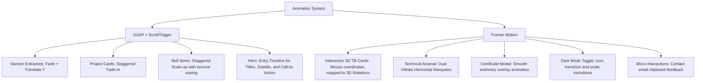

# A. Zahi Faleel – Portfolio Website: Project Summary & Architecture Documentation

This document provides a comprehensive overview of the portfolio website of **A. Zahi Faleel**. It details the site's architecture, technology stack, directory structure, UI/UX choices, animation workflows, and performance/SEO configurations.

---

## 🚀 1. Technology Stack Overview

The website is designed as a modern, high-fidelity single-page portfolio application. The core stack includes:

*   **Framework**: [React 18](https://react.dev/) – Component-driven frontend library.
*   **Language**: [TypeScript](https://www.typescriptlang.org/) – Adding static typing and interface definitions for robust development.
*   **Build Tool**: [Vite](https://vitejs.dev/) – High-performance development server and bundler.
*   **Styling**: [Tailwind CSS v3](https://tailwindcss.com/) & [PostCSS](https://postcss.org/) – Utility-first styling framework with custom configurations for spacing, keyframes, colors, and shadows.
*   **Animations**:
    *   [GSAP (GreenSock Animation Platform) v3](https://greensock.com/gsap/) with the **ScrollTrigger** plugin for complex scroll-driven, scroll-linked, and timeline transitions.
    *   [Framer Motion](https://www.framer.com/motion/) for element-level micro-interactions, layout transitions, drag/spring tilts, exit animations, and marquee loops.
*   **3D Graphics (Canvas)**: [Three.js](https://threejs.org/) via [@react-three/fiber](https://r3f.docs.pmnd.rs/getting-started/introduction) and [@react-three/drei](https://github.com/pmndrs/drei) for rendering a reactive particle background.
*   **Icons**: [Lucide React](https://lucide.dev/) for responsive SVG icons.

---

## 📂 2. Directory Structure & Roles

```text
Portfolio_Zahi/
├── .github/                   # GitHub configuration and workflow files
├── dist/                      # Production build output
├── docs/                      # Project documentation and summary files
│   └── PROJECT_SUMMARY.md     # Detailed architecture and design breakdown
├── public/                    # Static assets accessed via relative URL paths
│   └── assets/                # Images (profile.jpg, certificate images, logo.png)
├── src/                       # Application source code
│   ├── components/            # UI components and page sections
│   ├── hooks/                 # Custom React hooks (state & utilities)
│   ├── types/                 # TypeScript interfaces and type declarations
│   ├── utils/                 # Utility files and animation configuration scripts
│   ├── App.tsx                # Main layout and section orchestration
│   ├── index.css              # Global styles, Tailwind imports, custom typography, and classes
│   ├── main.tsx               # Client entry point rendering the React DOM
│   └── vite-env.d.ts          # TypeScript env configuration
├── eslint.config.js           # ESLint linting configuration
├── index.html                 # Main HTML template containing SEO meta tags
├── package.json               # Scripts, dependencies, and configuration
├── postcss.config.js          # PostCSS configuration for Tailwind CSS compilation
├── tailwind.config.js         # Tailwind configuration extending colors, fonts, and animations
├── tsconfig.json              # Main TypeScript config
├── tsconfig.app.json          # TypeScript config for the App
├── tsconfig.node.json         # TypeScript config for Vite configuration node environment
└── vite.config.ts             # Vite configuration with React plugin
```

### Key Source Files & Functions

*   `src/main.tsx`: Mounts the React application in `<StrictMode>` onto the HTML document element `#root`.
*   `src/App.tsx`: Orchestrates the main layout, renders global wrapper classes, loads the portfolio sections in order, and fires the scroll-based GSAP animations using a short `setTimeout` delay on mount.
*   `src/index.css`: Imports the Google fonts (*Inter* and *Space Grotesk*), injects custom scrollbar rules, defines reusable CSS classes (e.g., `.glass-panel`, `.glass-button`, `.text-glow`), and sets up custom text gradients.

---

## 🎨 3. UI/UX Design System & Aesthetics

The portfolio showcases a high-fidelity, premium interface optimized for both dark and light modes. The design features a modern, tech-forward aesthetic:

### A. Typography
*   **Headings**: *Space Grotesk* (sans-serif, geometric).
*   **Body Copy**: *Inter* (sans-serif, optimized for readability and interface design).

### B. Color Palette
The colors are customized via `tailwind.config.js`:
*   **Charcoal Dark System**:
    *   `charcoal-950`: `#050505` (Deep space black background)
    *   `charcoal-900`: `#0a0a0a`
    *   `charcoal-800`: `#121212`
    *   `charcoal-700`: `#1a1a1a`
*   **Neon & Electric Accent Accents**:
    *   `accent-cyan`: `#00f3ff` (Electric blue/cyan highlight color)
    *   `accent-purple`: `#9d00ff` (Vibrant purple accent glow)
*   **Interactive Gradients**: Gradients dynamically transition between `blue-600`, `cyan-500`, and `purple-600`.

### C. Core Design Patterns
1.  **Glassmorphism (`.glass-panel` & `.glass-button`)**:
    *   **Light Mode**: Uses a soft `bg-white/80` frosted ceramic background with high backdrop blur (`backdrop-blur-2xl`), a thin white border (`border-white/20`), and a subtle shadow.
    *   **Dark Mode**: Changes to a translucent `bg-charcoal-900/40` cyber glass panel with borders at `border-white/5` and transitions on hover for depth.
2.  **3D Tilt Cards (`TiltCard` in `Projects.tsx`)**:
    *   Encapsulates Framer Motion spring animations (`useSpring`) mapping cursor movements inside the card space (`clientX`, `clientY`) to dynamic rotation values (`rotateX` and `rotateY`).
    *   Produces an interactive, floating card layer that follows the user's cursor.
3.  **Infinite Marquee Tickers (`MarqueeRow` in `Skills.tsx`)**:
    *   Renders dual infinite scrolling rows of skills moving in opposite directions.
    *   Powered by Framer Motion looping translation configurations (`repeat: Infinity`, `ease: "linear"`).
4.  **Certificate Inspection Modal (`Certificates.tsx`)**:
    *   Enables full interactive overlays using Framer Motion's `<AnimatePresence>`. Clicking on any certification opens a modal showing the certificate document image, allowing keyboard/click exits safely with transition effects (`scale` and `opacity`).

---

## ⚡ 4. Animation Systems

The website splits its animation requirements between GSAP and Framer Motion:



### GSAP (GreenSock Animation Platform)
Configured in `src/utils/animations.ts`, it is registered with `ScrollTrigger`.
*   **Fade-In Sections**: Translates elements on the Y-axis (`y: 50` to `y: 0`) and fades them in as they enter `85%` of the viewport.
*   **Staggered Project Cards**: Animates project items with a scale factor of `0.95` and translates them with staggered delays (`index * 0.1`).
*   **Back-Easing Skills Entrance**: Skill badges scale up using a spring-back animation `back.out(1.7)`.
*   **Hero Entrance Timeline**: Instantiates a sequential timeline (`gsap.timeline()`) which handles hero title, subtitle, and CTA entrance timing.

### Framer Motion
Utilized directly inside components for fluid interactions:
*   `useMotionValue`, `useSpring`, and `useTransform` map and smooth mouse coordinate values to tilt parameters.
*   `<AnimatePresence>` ensures modal overlays fade/scale out smoothly when removed from the DOM.

---

## 🌌 5. The 3D Canvas Element (Particle Background)

The project includes `src/components/ParticleBackground.tsx` which integrates Three.js using React Three Fiber:
*   **Particle Generation**: Generates 3,000 points (`Float32Array`) arranged in a spherical distribution with varying depths (radii between `1.2` and `2.5`).
*   **Simulation Loop**: Uses the `useFrame` hook to:
    1.  Rotate the particle field automatically over time.
    2.  Check the cursor position and smoothly lerp (`linear interpolation`) rotation angles toward the mouse position, creating a subtle 3D depth reaction.
*   *Note*: This component is currently declared but commented out in `src/components/Hero.tsx`. Un-commenting it enables an electric-cyan particle background behind the hero section.

---

## 🛠️ 6. Theme Engine (Dark & Light Modes)

Theme state is managed locally via a custom hook (`useDarkMode.ts`) and triggered by the `DarkModeToggle` button component:
1.  **State Initialization**: Reads any stored preference (`localStorage.getItem('darkMode')`).
2.  **HTML Modification**: Upon change, updates `localStorage` and appends or removes the `.dark` class from the `document.documentElement` element.
3.  **Tailwind Integration**: Tailwind is configured with `darkMode: 'class'`, enabling custom overrides like `dark:bg-charcoal-950` and `dark:text-white`.

---

## 📈 7. SEO & Performance Configuration

*   **Single-Page Layout**: Smooth scroll-behavior anchors are mapped correctly in the Navigation links (`#about`, `#projects`, `#skills`, `#contact`).
*   **SEO Setup**: Inside `index.html`, specific viewport details, meta keywords, Open Graph attributes, and a meta description are included to make the website crawler-friendly and search-optimized.
*   **Fonts Preconnection**: Fonts are fetched with preconnect hints directly from Google's static server (`fonts.gstatic.com`) to avoid font-loading blocking.
*   **Asset Performance**: Heavy images (like profile picture and certificates) are stored in the optimized `/public/assets/` directory. The profile component features an image fallback `onError` handler linking to a high-quality Unsplash image to prevent UI breaks.
*   **Scroll Checkers**: The `Navbar` component tracks user viewport scrolling status with debounced scroll event listeners and maps classes according to whether `window.scrollY > 50` is met. It also dynamically sets the active tab by querying bounding rects of the page sections on scroll.
